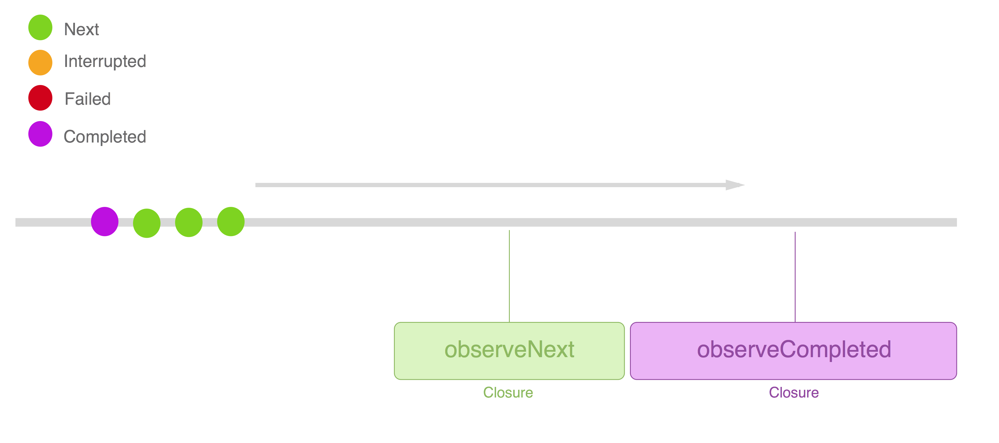

# Operators

With the concepts explained before you can start working with your first signals and signal producers. However, the most interesting part of Reactive is how we can combine them thanks to operators. Operators in ReactiveCocoa are primitives provided by the framework that can be applied over the streams of events. An *operator* then, is a function that transform signals and signals producers.

## Performing side effects

### Observation

Signals can be **observe**. It means that we can know about the events that are sent through that signal and specify what to do in that case.
ReactiveCocoa provides different operators for observation depending on the event you want to observe:

~~~~~~~~
mySignal.observe { event in
  // Observe all kind of events
  switch event {
    default: break
  }
}
mySignal.observeFailed { error in 
  print("Oh, something went wrong: \(error)")
}
mySignal.observeCompleted
mySignal.observeInterrupted
mySignal.observeNext { data in 
  print("Yeah!, new data: \(data)")
}
~~~~~~~~

T> Note that the side effects are specified with closures. Be careful retaining variables from the external scope of variables. The closure will be retained during the signal execution and a bad implementation of the signal might lead to components retained in memory and never released.

X> Signals shouldn't propagate more next events once the stream has been completed, cancelled or interrupted. In order to validate that I propose you the following exercise:
X> 1. Create a `Signal<Int, NoError>` using the pipe initializer.
X> 2. Observe that signal events printing next and completed events.
X> 3. Send the folloging events: 0, 1, 2, .Completed, 3. What do can you see in your console?

### Injecting effects

Similar to observe, with signal producers we can observe the events sent. In this case we use the `on` operator that returns another producer. It allows us chaining multiple observers applied to the same source producer.

~~~~~~~~
let otherProducer = sourceProducer
    |> on(started: {
        println("Started")
    }, event: { event in
        println("Event: \(event)")
    }, failed: { error in
        println("Error: \(error)")
    }, completed: {
        println("Completed")
    }, interrupted: {
        println("Interrupted")
    }, terminated: {
        println("Terminated")
    }, disposed: {
        println("Disposed")
    }, next: { next in
        println("Next: \(next)")
    })
~~~~~~~~

I> The method `on` has the parameters as optionasl, thus if you want to provide only the callback for the completed event you can pass only that callback.

## Composition

### Pipe

With signals the operator `|>` is used to apply a primitive to an event stream. In case of `SignalProducer` it also allows applying `Signal` primitives to `SignalProducer`:

~~~~~~~~
// Signal
public func |> <T, E, X>(signal: Signal<T, E>, @noescape transform: Signal<T, E> -> X) -> X {

// Signal producer
public func |> <T, E, U, F>(producer: SignalProducer<T, E>, transform: Signal<T, E> -> Signal<U, F>) -> SignalProducer<U, F>
public func |> <T, E, X>(producer: SignalProducer<T, E>, @noescape transform: SignalProducer<T, E> -> X) -> X
~~~~~~~~

For example, suppose we define the following primitive that given a `Signal` of integers, it adds a number to each integer:

~~~~~~~~
func sum(amount: Int)(input: Signal<Int, NoError>) -> Signal<Int, NoError> {
    return input.map({$0 + amount})
}
let integerPipe = Signal<Int, NoError>.pipe()
let integerObserver = integerPipe.1
let integerSignal = integerPipe.0
let signal = integerSignal |> sum(2)
~~~~~~~~

We define our primitive, in this case using flurry we made it more generic so that we can add any amount. Then we can apply it to any `Signal<Int, NoError>` signal.

### Lift

`lift` operators allow applying signal operators to a `SignalProducer`. The operator creates a new `SignalProducer` like if the operator had been applied to each produced `Signal` individually.

## Transforming

### Mapping
// TODO

### Filtering
// TODO

### Aggregating
// TODO

## Combining

### Latest values
// TODO

### Zipping
// TODO

## Flattening

### Concatenating
// TODO

### Merging
// TODO

### Switching to the latest
// TODO

## Handling Errors

### Catching Errors
//TODO

### Mapping Errors
//TODO

### Retrying
//TODO

### DON'T FORGET
- Mention how the source signals are disposed when the combined signal is disposed
- Mention Red library that add extra operators and mention these operators.
- Mention this util website: http://rxmarbles.com/
