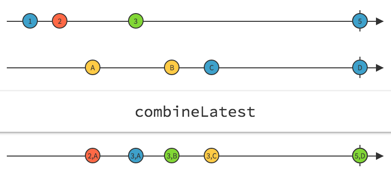
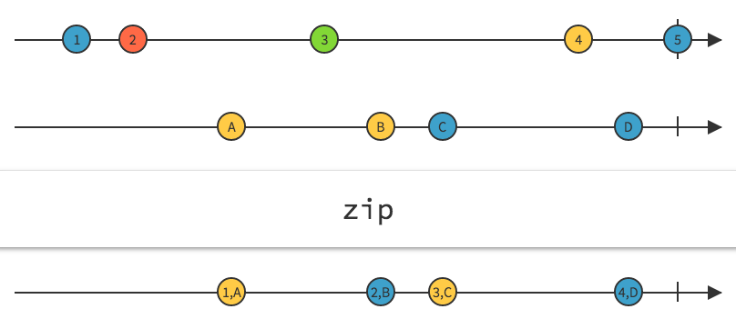
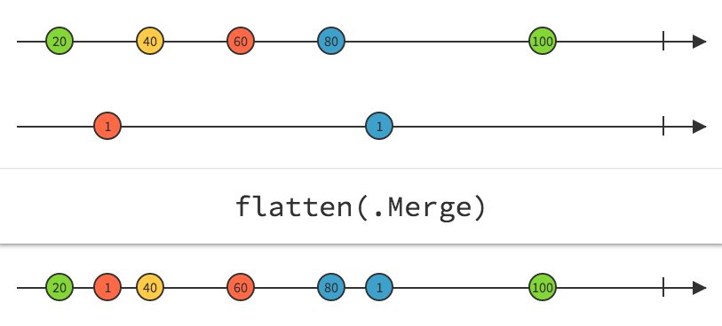

# Operators

With the concepts explained before you can start working with your first signals and signal producers. However, the most interesting part of Reactive is how we can combine them thanks to operators. Operators in ReactiveCocoa are primitives provided by the framework that can be applied over the streams of events. An *operator* then, is a function that transform signals and signals producers.

**Notes**
- This section of the book is possible **thanks** to [ReactiveCocoa](https://github.com/reactivecocoa/reactivecocoa) and its provided Wiki. Most of the contend has been extracted from there and complemented with interactive diagram and extra operators missing. Special thanks to all [contributors](https://github.com/ReactiveCocoa/ReactiveCocoa/graphs/contributors) that have made that possible.

- There's a website, [**RAC Marble**](http://neilpa.me/rac-marbles) with interactive diagrams where you can check the behaviour of each operator mentioned. Use it whenever you have doubt about any operator that you've using.

- There's a set of ReactiveCocoa extensions available, [Rex](https://github.com/neilpa/Rex) implemented by [@neilpa](https://github.com/neilpa) that add extra non-existing and very useful operators to ReactiveCocoa.

## Performing side effects

### Observation

Signals can be **observe**. It means that we can know about the events that are sent through that signal and specify what to do in that case.
ReactiveCocoa provides different operators for observation depending on the event you want to observe:

~~~~~~~~
mySignal.observe { event in
  // Observe all kind of events
  switch event {
    default: break
  }
}
mySignal.observeFailed { error in
  print("Oh, something went wrong: \(error)")
}
mySignal.observeCompleted
mySignal.observeInterrupted
mySignal.observeNext { data in
  print("Yeah!, new data: \(data)")
}
~~~~~~~~

T> Note that the side effects are specified with closures. Be careful retaining variables from the external scope of variables. The closure will be retained during the signal execution and a bad implementation of the signal might lead to components retained in memory and never released.

X> Signals shouldn't propagate more next events once the stream has been completed, cancelled or interrupted. In order to validate that I propose you the following exercise:
X> Create a `Signal<Int, NoError>` using the pipe initializer.
X> Observe that signal events printing next and completed events.
X> Send the folloging events: 0, 1, 2, .Completed, 3. What do can you see in your console?

### Injecting effects

Similar to observe, with signal producers we can observe the events sent. In this case we use the `on` operator that returns another producer. It allows us chaining multiple observers applied to the same source producer.

~~~~~~~~
let otherProducer = sourceProducer
    |> on(started: {
        println("Started")
    }, event: { event in
        println("Event: \(event)")
    }, failed: { error in
        println("Error: \(error)")
    }, completed: {
        println("Completed")
    }, interrupted: {
        println("Interrupted")
    }, terminated: {
        println("Terminated")
    }, disposed: {
        println("Disposed")
    }, next: { next in
        println("Next: \(next)")
    })
~~~~~~~~

I> The method `on` has the parameters as optionals, thus if you want to provide only the callback for the completed event you can pass only that callback.

## Composition

### Lift

`lift` operators allow applying signal operators to a `SignalProducer`. The operator creates a new `SignalProducer` like if the operator had been applied to each produced `Signal` individually.

## Transforming

### Mapping

[**Interactive diagram:**](http://neilpa.me/rac-marbles/#map)

`map` operator transforms the event next values using using the passed function. Given an input `Signal<T, NoError>`/`SignalProducer<T, NoError>` and a function that transform `T` into a new type `M`, `myFunc(input: T) -> M` the operator can be applied on this way:

~~~~~~~~
mySignal.map(mappingFunction)
~~~~~~~~

Imagine we have a text field where the user inputs data and we have to validate that the introduced data is not empty. Our current signal only returns the text that the user is typing in the field. Thanks to the `map` operator we can have instead a signal that returns `true` or `false` depending on wether the field is empty or not:

~~~~~~~~
let (userTextSignal, userTextObserver) = Signal<Int, NoError>.pipe()
let isValid: Signal<Bool, NoError> = userTextSignal.map{$0 != ""}
isValid.observeNext { valid in print(valid) }
userTextObserver.sendNext("") // should print false
userTextObserver.sendNext("pep@") // should print true
~~~~~~~~
> Note: $0 represents the values sent through the signal where in this case it's the text introduced.

### Filtering

[**Interactive diagram:**](http://neilpa.me/rac-marbles/#filter)

`filter` is used to filter next values using a provided predicate. Only these values that satisfy the predicate will be propagated to the output stream. The `filter` operator expects a closure where that takes each next value and returns `true`/`false`:

~~~~~~~~
mySignal.filter(filterFunction)
~~~~~~~~

Imagine we are listing a set of Github issues in a TableView and each issue contains an attribute `assigned` with the assigned person. We would like to list only these issues that are assigned to me taking into account that the source signal returns all the existing issues:

~~~~~~~~
let me: User // Equatable struct
let issuesSignal: Signal<Issue, NoError> // Created previously
let myIssuesSignal = issuesSignal.filter { $0.assigned == me }
myIssuesSignal.observeNext { issues in
  print("I have \(issues.count) issues assigned")
}
~~~~~~~~

### Aggregating

#### Reduce

[**Interactive diagram:**](http://neilpa.me/rac-marbles/#reduce)

`reduce` allows combining event stream's values into a single value. How these values are combined are specified with a closure passed to this operator. The resulting signal doesn't send the final reduced value until the original one completes.

We can use it for example to group multiple arrays into a signel array. In the example below we've a `Signal` that returns arrays of issues *(for example coming from paginated requests to the API)* and we use the reduce operator. The opeator needs an *initial value* and then the closure that takes as arguments the *previous value* and the *new next event value* and returns the reduced value where in this case is another array of issues with the new values concatenated.

~~~~~~~~
let (issuesSignal, issuesObserver) = Signal<[Issue], HttpError>.pipe
signal
  .reduce([]) { (previous: [Issue], new: [Issue]) -> [Issue] in
    var mutablePrevious = previous
    mutablePrevious.appendContentsOf(new)
    return mutablePrevious
  }
  .observeNext { issues in print(issues.count) }
observer.sendNext([issue1, issue2]])     // nothing printed
observer.sendNext([issue2, issue3])      // nothing printed
observer.sendCompleted()   // prints 4
~~~~~~~~

T> In the example above we've reduced the operators in a single array but you can use any other output value type. The operator allows you combining the values in whatever output value you need. It's up to you to specify how they're reduced.

#### Collect

`collect` is ussed to combine all stream's values into a single array of values. The array is not sent until the source signal completes *(which means it won't send any more values through the stream)*

~~~~~~~~
let (signal, observer) = Signal<Int, NoError>.pipe()
signal
    .collect()
    .observeNext { next in print(next) }
observer.sendNext(1)     // nothing printed
observer.sendNext(2)     // nothing printed
observer.sendNext(3)     // nothing printed
observer.sendCompleted()   // prints [1, 2, 3]
~~~~~~~~

## Combining

Combining operators combine multiple streams values into a single stream

### Latest values

[**Interactive diagram:**](http://neilpa.me/rac-marbles/#combineLatest)

`combineLatest` combine the last sent value through multiple streams into a single stream whose values are tuples with these last values.

The first value will be sent once all of the streams have sent at least one value. Every time any streams sends a new value, the resulting stream will send a new value with that value and the last from the other streams.

~~~~~~~~
let (numbersSignal, numbersObserver) = Signal<Int, NoError>.pipe()
let (lettersSignal, lettersObserver) = Signal<String, NoError>.pipe()

let signal = combineLatest(numbersSignal, lettersSignal)
signal.observeNext { next in print("Next: \(next)") }
signal.observeCompleted { print("Completed") }

numbersObserver.sendNext(1)      // nothing printed
numbersObserver.sendNext(2)      // nothing printed
lettersObserver.sendNext("A")    // prints (2, A)
numbersObserver.sendNext(3)      // prints (3, A)
numbersObserver.sendCompleted()  // nothing printed
lettersObserver.sendNext("B")    // prints (3, B)
lettersObserver.sendNext("C")    // prints (3, C)
lettersObserver.sendCompleted()  // prints "Completed"
~~~~~~~~

### Zipping

[**Interactive diagram:**](http://neilpa.me/rac-marbles/#zip)

The zip function joins values of two (or more) event streams pair-wise. The elements of any Nth tuple correspond to the Nth elements of the input streams.

That means the Nth value of the output stream cannot be sent until each input has sent at least N values.

~~~~~~~~
let (numbersSignal, numbersObserver) = Signal<Int, NoError>.pipe()
let (lettersSignal, lettersObserver) = Signal<String, NoError>.pipe()

let signal = zip(numbersSignal, lettersSignal)
signal.observeNext { next in print("Next: \(next)") }
signal.observeCompleted { print("Completed") }

numbersObserver.sendNext(1)      // nothing printed
numbersObserver.sendNext(2)      // nothing printed
lettersObserver.sendNext("A")    // prints (1, A)
numbersObserver.sendNext(3)      // nothing printed
numbersObserver.sendCompleted()  // nothing printed
lettersObserver.sendNext("B")    // prints (2, B)
lettersObserver.sendNext("C")    // prints (3, C)
numbersObserver.sendNext(5)      // nothing printed
lettersObserver.sendNext("D")    // prints (4, D)
numbersObserver.sendNext(5)      // nothing printed
~~~~~~~~

You can also use the `zipWith` operator applied to a `Signal`:

~~~~~~~~
let signal = numbersSignal.zipWith(lettersSignal)
~~~~~~~~

## Flattening producers

The flatten operator transforms a SignalProducer-of-SignalProducers into a single SignalProducer whose values are forwarded from the inner producer in accordance with the provided FlattenStrategy.

To understand, why there are different strategies and how they compare to each other, take a look at this example and imagine the column offsets as time:

~~~~~~~~
let values = [
// imagine column offset as time
[ 1,    2,      3 ],
   [ 4,      5,     6 ],
         [ 7,     8 ],
]

let merge =
[ 1, 4, 2, 7,5, 3,8,6 ]

let concat =
[ 1,    2,      3,4,      5,     6,7,     8]

let latest =
[ 1, 4,    7,     8 ]
~~~~~~~~

Note, how the values interleave and which values are even included in the resulting array.

### Merging

[**Interactive diagram:**](http://neilpa.me/rac-marbles/#merge)

The `.Merge` strategy immediately forwards every value of the inner `SignalProducers` to the outer `SignalProducer`. Any failure sent on the outer producer or any inner producer is immediately sent on the flattened producer and terminates it.

~~~~~~~~
let (producerA, observerA) = SignalProducer<Int, NoError>.buffer(5)
let (producerB, observerB) = SignalProducer<Int, NoError>.buffer(5)
let (signal, observer) = SignalProducer<SignalProducer<Int, NoError>, NoError>.buffer(5)

signal.flatten(.Merge).startWithNext { next in print(next) }

observer.sendNext(producerA)
observer.sendNext(producerB)
observer.sendCompleted()

observerA.sendNext(20)          // prints "20"
observerB.sendNext(1)           // prints "1"
observerA.sendNext(40)          // prints "40"
observerA.sendNext(60)          // prints "60"
observerA.sendNext(80)          // prints "80"
observerB.sendNext(1)           // prints "1"
observerA.sendNext(100)         // prints "100"
~~~~~~~~

### Concatenating

[**Interactive diagram:**](http://neilpa.me/rac-marbles/#concat)

The `.Concat` strategy is used to serialize work of the inner SignalProducers. The outer producer is started immediately. Each subsequent producer is not started until the preceeding one has completed. Failures are immediately forwarded to the flattened producer.

~~~~~~~~
let (producerA, lettersObserver) = SignalProducer<String, NoError>.buffer(5)
let (producerB, numbersObserver) = SignalProducer<String, NoError>.buffer(5)
let (signal, observer) = SignalProducer<SignalProducer<String, NoError>, NoError>.buffer(5)

signal.flatten(.Concat).startWithNext { next in print(next) }

observer.sendNext(producerA)
observer.sendNext(producerB)
observer.sendCompleted()

numbersObserver.sendNext("1")    // nothing printed
lettersObserver.sendNext("a")    // prints "a"
lettersObserver.sendNext("b")    // prints "b"
numbersObserver.sendNext("2")    // nothing printed
lettersObserver.sendNext("c")    // prints "c"
lettersObserver.sendCompleted()    // prints "1", "2"
numbersObserver.sendNext("3")    // prints "3"
numbersObserver.sendCompleted()
~~~~~~~~

### Switching to the latest
The .Latest strategy forwards only values from the latest input SignalProducer.

~~~~~~~~
let (producerA, observerA) = SignalProducer<String, NoError>.buffer(5)
let (producerB, observerB) = SignalProducer<String, NoError>.buffer(5)
let (producerC, observerC) = SignalProducer<String, NoError>.buffer(5)
let (signal, observer) = SignalProducer<SignalProducer<String, NoError>, NoError>.buffer(5)

signal.flatten(.Latest).startWithNext { next in print(next) }

observer.sendNext(producerA)   // nothing printed
observerC.sendNext("X")        // nothing printed
observerA.sendNext("a")        // prints "a"
observerB.sendNext("1")        // nothing printed
observer.sendNext(producerB)   // prints "1"
observerA.sendNext("b")        // nothing printed
observerB.sendNext("2")        // prints "2"
observerC.sendNext("Y")        // nothing printed
observerA.sendNext("c")        // nothing printed
observer.sendNext(producerC)   // prints "X", "Y"
observerB.sendNext("3")        // nothing printed
observerC.sendNext("Z")        // prints "Z"
~~~~~~~~

## Handling Errors

These operators are used to handle failures that might occur on an event stream.

### Catching Errors
The `flatMapError` operator catches any failure that may occur on the input `SignalProducer`, then starts a new SignalProducer in its place.

~~~~~~~~
let (producer, observer) = SignalProducer<String, NSError>.buffer(5)
let error = NSError(domain: "domain", code: 0, userInfo: nil)

producer
    .flatMapError { _ in SignalProducer<String, NoError>(value: "Default") }
    .startWithNext { next in print(next) }

observer.sendNext("First")     // prints "First"
observer.sendNext("Second")    // prints "Second"
observer.sendFailed(error)     // prints "Default"
~~~~~~~~

### Mapping Errors

The `mapError` operator transforms the error of any failure in an event stream into a new error.

~~~~~~~~
enum CustomError: String, ErrorType {
    case Foo = "Foo"
    case Bar = "Bar"
    case Other = "Other"

    var nsError: NSError {
        return NSError(domain: "CustomError.\(rawValue)", code: 0, userInfo: nil)
    }

    var description: String {
        return "\(rawValue) Error"
    }
}

let (signal, observer) = Signal<String, NSError>.pipe()

signal
    .mapError { (error: NSError) -> CustomError in
        switch error.domain {
        case "com.example.foo":
            return .Foo
        case "com.example.bar":
            return .Bar
        default:
            return .Other
        }
    }
    .observeFailed { error in
        print(error)
    }

observer.sendFailed(NSError(domain: "com.example.foo", code: 42, userInfo: nil))    // prints "Foo Error"
~~~~~~~~

### Retrying

The `retry` operator will restart the original SignalProducer on failure up to count times.

~~~~~~~~
var tries = 0
let limit = 2
let error = NSError(domain: "domain", code: 0, userInfo: nil)
let producer = SignalProducer<String, NSError> { (observer, _) in
    if tries++ < limit {
        observer.sendFailed(error)
    } else {
        observer.sendNext("Success")
        observer.sendCompleted()
    }
}

producer
    .on(failed: {e in print("Failure")})    // prints "Failure" twice
    .retry(2)
    .start { event in
        switch event {
        case let .Next(next):
            print(next)                     // prints "Success"
        case let .Failed(error):
            print("Failed: \(error)")
        case .Completed:
            print("Completed")
        case .Interrupted:
            print("Interrupted")
        }
    }
~~~~~~~~

If the `SignalProducer` does not succeed after `count` tries, the resulting SignalProducer will fail. E.g., if `retry(1)` is used in the example above instead of `retry(2)`, `"Signal Failure"` will be printed instead of "Success".

### Promote errors

The `promoteErrors` operator promotes an event stream that does not generate failures into one that can.

~~~~~~~~
let (numbersSignal, numbersObserver) = Signal<Int, NoError>.pipe()
let (lettersSignal, lettersObserver) = Signal<String, NSError>.pipe()

numbersSignal
    .promoteErrors(NSError)
    .combineLatestWith(lettersSignal)
~~~~~~~~

The given stream will still not actually generate failures, but this is useful because some operators to combine streams require the inputs to have matching error types.

## Other useful operators

### Flatmap

`flatMap` maps every stream value into a new `SignalProducer`/`SignalProducer` and forward their values through the main stream using the defined `FlattenStrategy` that can be any of the strategies seen before, `merge`, `concat`, `latest`.

~~~~~~~~
let (innerProducer, innerObserver) = SignalProducer<String, NoError>.buffer(5)
let (signal, observer) = SignalProducer<String, NoError>.buffer(5)
signal.flatMap(.Concat) { (input) -> SignalProducer<String, NoError> in
   return innerProducer.map({"\(input)-\($0)"})
}.startWithNext { (next) -> () in
   print(next)
}
innerObserver.sendNext("A") // nothing printed
innerObserver.sendNext("B") // nothing printed
innerObserver.sendNext("C") // nothing printed
innerObserver.sendCompleted() // nothing printed
observer.sendNext("1") // printed 1-A, 1-B, 1-C
observer.sendNext("2") // printed 2-A, 2-B, 2-c
~~~~~~~~

### Skip
Skips the first `x` values of a `Signal`/`SignalProducer` and sends the values afterwards.

~~~~~~~~
let (signal, observer) = Signal<String, NoError>.pipe()
let skipSignal = signal.skip(2)
skipSignal.observeNext { next in
    print(next)
}
observer.sendNext("A") // nothing printed
observer.sendNext("B") // nothing printed
observer.sendNext("C") // printed C
observer.sendCompleted()
~~~~~~~~

### Take
Sends the first `x` values of a `Signal`/`SignalProducer` and stops sending afterwards. When these values are received then a `completed` event is sent.

~~~~~~~~
let (signal, observer) = Signal<String, NoError>.pipe()
let takeSignal = signal.take(2)
takeSignal.observeNext { next in
    print(next)
}
observer.sendNext("A") // printed A
observer.sendNext("B") // printed B
observer.sendNext("C") // nothing printed
observer.sendCompleted()
~~~~~~~~

### TakeLast
Waits until the `Signal`/`SignalProducer` is completed and then it sends the last `x` values sent through the stream.

~~~~~~~~
let (signal, observer) = Signal<String, NoError>.pipe()
let takeLastSignal = signal.takeLast(2)
takeLastSignal.observeNext { next in
    print(next)
}
observer.sendNext("A") // nothing printed
observer.sendNext("B") // nothing printed
observer.sendNext("C") // nothing printed
observer.sendCompleted() // printed B, C
~~~~~~~~

### TakeUntil
It'll send values until a `Next` or `Completed` event is received from a provided `Signal`/`SignalProducer`. That one controls the main stream and decide when no more values should be forwared.

~~~~~~~~
let (signal, observer) = Signal<String, NoError>.pipe()
let (controlSignal, controlObserver) = Signal<String, NoError>.pipe()
let controlledSignal = signal.takeUntil(controlSignal)
controlledSignal.observeNext { next in
    print(next)
}
observer.sendNext("A") // printed A
observer.sendNext("B") // printed B
controlObserver.sendCompleted() // nothing printed
observer.sendNext("C") // nothing printed
observer.sendNext("D") // nothing printed
~~~~~~~~

### Delay

### Materialize/Dematerialize
// TODO

### SampleOn
// TODO

### TakeUntil
// TODO

### TakeWhile
// TODO

### SkipUntil
// TODO

### Scan
// TODO

### SkipRepeats
// TODO

### SkipWhile
// TODO

### TakeUntilReplacement
// TODO

### Attempt
// TODO

### AttemptMap
// TODO

### Throttle
// TODO
